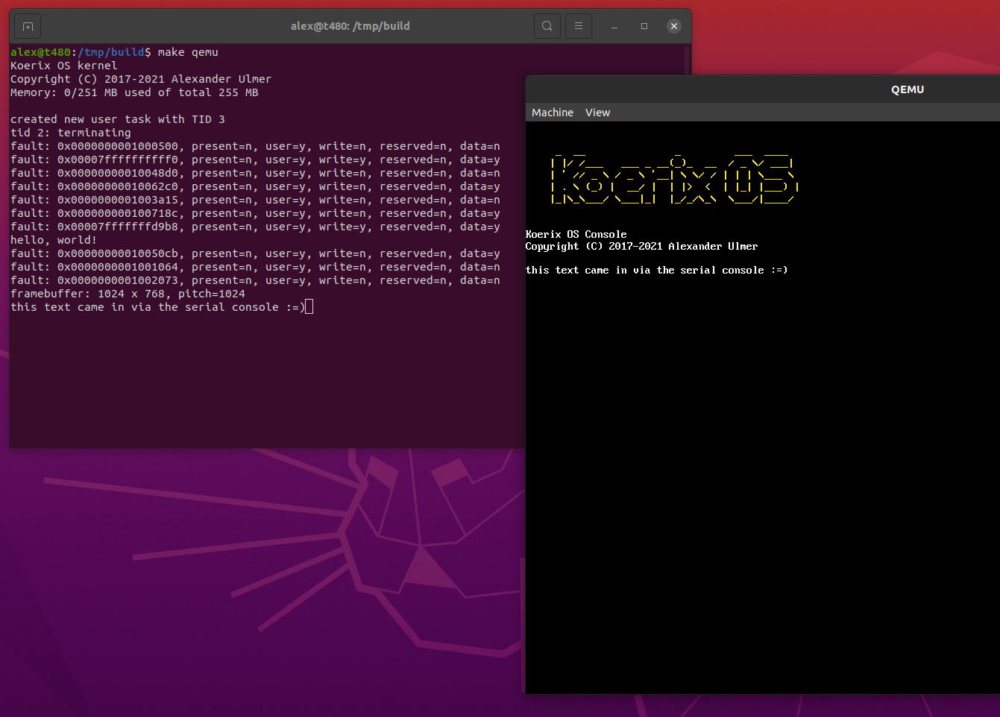

# Koerix

## What is Koerix?
Koerix is a Unix-like hobby OS written in C++. I am mainly targeting the
`x86_64` (on PC) and `AArch64` (on raspi4) architectures, but I'm also
interested in getting the OS to work on `i386` and `arm` 32bit architectures.
This repo is the patched-together result of ~4 years of on/off work on my
OS projects (turns out OS development is real hard, so I started over again
a few times). It's not the most stable, yet, (especially on real hardware) but I'm
getting there.

Version 1.0 will be shipped as soon as bash and busybox are up and running :)



In the image, you can see the userspace program `textcon` in action. the terminal
to the left shows the serial output. `textcon` will print everything on the screen
it reads from it's stdin (in this case, the serial console).

## Licensing
While the kernel (directories `arch/`, `platform/`, `kernel/`) and userspace environment
programs (`env/`) is licensed under the terms of the GNU Lesser General Public License,
the directory `libc/` contains large parts of the *Musl* libc, which is provided under
the terms of the MIT license. Additionally, all files should have a SPDX comment at the top
stating the exact license and copyright holder. If they don't: please tell me or open
a pull request.

## Current Kernel Features
* x86_64 kernel (64bit) written in C++, C as well as some GNU Assembler
* preemptive multitasking (single core), Mutexes and Spinlocks
* full paged Virtual Memory support
* POSIX `fork()` with multi-level copy-on-write
* `read()`, `write()`, `open()`, `close()` via Virtual file system (WIP)
* system calls via software interrupt 0x80
* `limine` bootloader
* Processes and Threads (but no `fork()` and `exec()` so far)
* OS support for FPU/SSE

## Drivers
* PC Serial port driver (for getting a shell and some debug output)

## Userspace features
* Standard C-library (by copying and modifying sources from musl libc as needed)
* Full resolution framebuffer access via `libc`.

## Available Software
* `textcon`: A userspace program that prints everything it reads from stdin to the
framebuffer providing a text console. It also opens the keyboard device and prints
everything it reads from there to stdout.

## Runtime configuration
The kernel can be configured at boot time (via the kernel command line) 
to do a few things. For example:
* `console=/dev/uart0` will open a serial console on `uart0` (first serial port)
* `init=/bin/init` will load the specified binary from disk and run it after booting
* `init=@some_mod` will load the specified module passed via the bootloader and run it after booting

## Building
Building the kernel and userspace binaries:
```
$ git clone --recursive https://github.com/ulmer-a/koerix
$ mkdir -p koerix/build && cd koerix/build
$ cmake ..
$ make -j
```

Assembling a diskimage:
```
$ make disk    # this will build the limine bootloader
               # from source and generate a disk image
$ make qemu    # this will start your diskimage in QEMU
```
